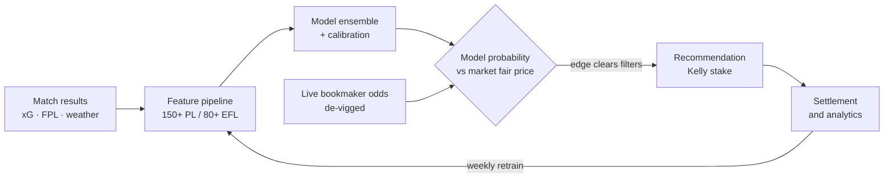

# Premier League & EFL Championship Betting System

A statistical betting system for English football goals markets. It produces its own
probability estimates for match outcomes — will there be over 2.5 goals, will both teams
score — compares them against the probabilities implied by bookmaker odds, and recommends a
stake only where the two disagree by enough to be worth acting on.

The premise is deliberately narrow. Betting markets are close to efficient, so the aim is
not to predict football well in absolute terms; it is to be **wrong differently from the
market**, in a way that turns out right slightly more often than chance. Every design
choice follows from that: an ensemble of models that fail in dissimilar ways, validation
that never looks at the future, and several layers of conservatism sitting between a raw
prediction and a recommended bet.

The system runs itself. It fetches odds on matchdays, retrains weekly on newly settled
results, grades its own bets against final scores, and reports on a dashboard whether the
edge it claims is actually showing up.

---

## How it works



Six stages: ingest data, engineer features, model probabilities, compare against odds and
recommend, operate on a schedule, then settle and analyse. The loop closes — every
recommendation is graded against the real result and feeds the next retrain.

---

## Data

No single source has everything, so each one has a defined job.

| Source | Provides | Used for |
|---|---|---|
| football-data.co.uk | Historical results from 2000: scores, shots, corners, cards | The training backbone |
| football-data.org | Recent results | Keeping the dataset current between CSV releases |
| Understat | Expected goals, shot quality, tactical stats | Richer Premier League features |
| Fantasy Premier League API | Team strengths, injuries, availability | Premier League features and live team news |
| Open-Meteo | Match-day weather | Wind and rain mildly suppress goals |
| The-Odds-API | Live odds from 14+ bookmakers | Market prices for O/U 2.5 and BTTS |
| OddsPapi | Odds from 100+ books including Pinnacle and Betfair | Sharp reference prices, alternative lines |
| ESPN scoreboard | Final scores | Settling bets after matches finish |
| Betfair historical data | Exchange prices back to 2016 | Backtesting against real execution prices |

Two disciplines apply throughout. **Team names are normalised through explicit mapping
tables**, never fuzzy matching — inconsistent club naming across feeds has historically been
the single largest source of silent bugs, so unresolved names raise rather than guess.
**API quota is treated as a scarce resource**: responses are cached with a 30-minute TTL,
stale caches are served if a fetch fails, and the scheduler is fixture-aware so calls are
only spent on days with actual matches.

The models train on seasons from 2014-15 onward (`TRAIN_MIN_SEASON = 14`), which is where
expected-goals data begins. Earlier seasons remain in the dataset but are excluded from
training rather than padded with nulls.

---

## Feature engineering

Raw scorelines are not model input. The pipelines compute, for every historical match, a
description of how good each side was at that moment: rolling form over 5, 10 and 20 games;
attack and defence strength relative to the league; conversion rates; expected-goals
measures; fixture congestion and discipline; context flags such as promotion, derbies and
league position; and match-day weather.

The guiding idea is that **shots and corners predict better than goals do**. Goals are rare
and heavily influenced by luck; a side creating fifteen chances a game is genuinely strong
even if it lost 1-0 last week. High-frequency process statistics carry more signal than
low-frequency outcomes, and shot and corner features do in fact dominate the model's
importance rankings.

One exclusion is deliberate: **bookmaker odds are never used as features**. The entire
design compares the model against the market, so letting the market's opinion into the
model would make that comparison circular.

---

## The models

The Premier League ensemble combines four base models; the Championship uses three, with
logistic regression excluded because there is not enough rich data for it to add value.

**Dixon-Coles** is the structural model. Goals in football follow a Poisson process closely,
so rather than learning goal-scoring from scratch it builds that structure in and only
estimates each team's scoring rate. A correction term adjusts the four low-scoring
scorelines, where real football produces more 0-0 and 1-1 draws than independent Poisson
predicts. It is the strongest single model here (test AUC around 0.60) and, because it
produces a full scoreline distribution, it alone prices the alternative goal lines.

**XGBoost and LightGBM** are gradient-boosted tree models. They find interactions a formula
would miss — high shot volume mattering more against a deep-defending opponent in dry
conditions, for instance. Individually they are mediocre, around 0.53 to 0.55 AUC; they earn
their place because their mistakes differ from Dixon-Coles's.

**Logistic regression** is a linear baseline that cannot learn interactions, which makes it
stable and hard to fool.

A **stacker** learns how much to trust each of them, trained on out-of-fold predictions —
each base model scoring seasons it was not trained on — so it cannot simply reward whichever
model memorised the training set best.

Two disciplines make the numbers trustworthy:

- **Walk-forward validation.** Train on seasons up to N, test on N+1, slide forward, repeat.
  Ordinary shuffled cross-validation would let a model predicting 2019 have already seen
  2024. Football also drifts across eras, and walk-forward measures performance under that
  drift honestly.
- **Calibration.** Ranking matches well is not the same as outputting honest probabilities.
  Platt scaling stretches the stacker's output so that matches given 60% historically went
  over roughly 60% of the time, and a regime check shifts calibration mid-season if scoring
  rates diverge from the historical base rate of about 52% for over 2.5.

---

## Turning a probability into a bet

A probability is not yet a bet. Four things happen between the two.

**De-vigging.** Decimal odds of 2.00 imply 50%, but a two-sided market's implied
probabilities sum to about 104–108% — the excess is the bookmaker's margin. Stripping it
proportionally recovers the market's genuine opinion, the *fair probability*. Pinnacle is
preferred as the reference because its low margin and tolerance of winning customers make
its line the best available proxy for the truth; edges derived from softer books are
discounted by 20% as a penalty for their noise.

**Blending.** The system does not bet its own model output. It stakes on a blend of
**35% model and 65% market fair probability**. The market is very efficient and the model is
imperfect, so this forces the model only ever to disagree at the margin. It is the single
largest piece of conservatism in the design. In the first few gameweeks of a season, when
form data is thin, the model's weight drops to 20% and the thresholds tighten further.

**Filtering.** A positive edge alone only makes a *Pick*. To become a *Recommendation* it
must clear a minimum edge threshold and pass a model-agreement check requiring at least two
base models to independently land on the same side of the market's price — a guard against
a single model going rogue.

**Staking.** The Kelly criterion gives the stake that maximises long-run growth for a given
edge, but full Kelly is far too aggressive when the edge estimate is itself uncertain. The
system stakes **quarter-Kelly**, then scales further by market strength, by how many models
agree, and by drawdown — stakes shrink automatically during a losing run — under a hard
per-bet cap.

---

## Markets

The principle is to bet only where backtesting shows an edge, and to keep everything else
priced but unstaked so that its calibration continues to be measured.

| Market | Priced by | Status |
|---|---|---|
| PL over/under 2.5 | Full four-model ensemble | Active — the flagship market |
| PL both teams to score | Full ensemble, BTTS-trained | Active |
| PL over/under 1.5 | Dixon-Coles alone | Active, Over side only — backtesting found no edge on Under |
| PL other alternative lines | Dixon-Coles | Priced, not bet — no proven edge |
| EFL over/under 1.5, BTTS | EFL three-model ensemble | Active |
| EFL over/under 2.5 | EFL ensemble | Monitored — tracked but never staked |
| EFL over/under 3.5 | Dixon-Coles | Alternative-line path, both sides permitted |

EFL over/under 2.5 illustrates the point. It backtests at roughly +1.2% gross ROI, which is
positive but unlikely to survive exchange commission, so it is priced and settlement-tracked
for diagnostic value without any money going on it. It can be reactivated if the evidence
improves.

---

## Measuring whether the edge is real

This is the part that matters most, and the dashboard's Model Analytics tab exists to make
self-deception difficult:

- **Wilson confidence intervals** on every hit rate, so that ten wins from fifteen bets is
  reported as a wide interval rather than a 67% win rate.
- **Calibration plots** asking directly whether outcomes given 60% happen 60% of the time,
  with thin bins dropped rather than plotted.
- **Strategy counterfactuals** running three parallel histories — recommended bets with
  Kelly sizing, the same bets flat-staked, and every positive-edge pick flat-staked — which
  separates the value of the filters from the value of the staking.
- **Closing-line value**, comparing the odds taken against the market's final price. Beating
  the closing line is the strongest early evidence that an edge is real, since the closing
  line is the market's most informed opinion.
- **Sample-adequacy badges** on every per-market breakdown, so a thin sample cannot pass
  itself off as proven.

The same scepticism applies to the system's own design. The model-agreement filter, for
example, had been applied to every recommendation for months without ever being tested; the
work in [ADR 0010](docs/adr/0010-agreement-evidence-from-the-oof-cache.md) established that
the backtest runners structurally *could not* answer the question, because they emit
post-filter bets only, and rebuilt the evidence from pre-filter out-of-fold caches instead.

---

## Known limitations

Stated plainly, because they shape how much the results should be trusted.

1. **The edge is thin and the market is good.** The best single model reaches around 0.60
   AUC. This is a margins game won by discipline, not a crystal ball.
2. **Calibration drifts about 3–6% hot** on test data. Rankings hold and edges are computed
   relatively, so edge detection survives it, but absolute probabilities are slightly
   inflated — which is precisely why the blend, quarter-Kelly and agreement filters exist.
3. **Backtest ROI is not future ROI.** Historical backtesting produced around +9.7% ROI at a
   10% edge threshold, measured against historical prices. Live markets adapt, and soft
   bookmakers restrict winning accounts.
4. **Liquidity is largely unmeasured.** The historical Betfair data records last traded price
   only, and live probing found that goals-market liquidity does not really arrive until
   roughly a day before kick-off. Early prices exist; early *fillable size* mostly does not.
5. **Live samples are small.** A full season of recommendations is statistically few bets,
   which is why every headline number carries an interval.
6. **The EFL side is thinner** — less data, no Understat or FPL coverage, a three-model
   ensemble, and its main market monitored rather than staked.

---

## Running the system

Requires Python 3.13. API keys are read from a `.env` file, which is not tracked.

```bash
pip install -r requirements.txt
```

```bash
python run.py
```

That starts the dashboard on `http://127.0.0.1:8050` alongside the scheduler. Individual
jobs can be run on their own:

```bash
python run.py predict
```

`predict`, `settle`, `refresh`, `retrain`, `fetch` and `dashboard` are all available as
one-shot actions. The test suite runs with `pytest`.

---

## Repository map

| Path | Contents |
|---|---|
| `config.py`, `league_config.py` | Central configuration: paths, feature sets, thresholds, per-league structure |
| `pipeline.py`, `championship_pipeline.py` | Feature engineering for the Premier League and Championship |
| `model.py`, `championship_model.py` | Ensemble training and walk-forward cross-validation |
| `predict.py`, `championship_predict.py` | Live prediction engines |
| `alt_lines.py` | Alternative goal-line pricing from the Dixon-Coles distribution |
| `staking.py` | Bet selection, Kelly staking and portfolio constraints |
| `scan.py`, `scheduler.py`, `run.py` | Odds scanning, scheduled jobs, entry point |
| `settlement.py`, `edge_analytics.py`, `clv_tracker.py` | Grading bets and analysing results |
| `dashboard.py` | Dash web interface |
| `db.py` | SQLite schema and data access |
| `api/` | Connectors for every external data source |
| `data/`, `scripts/` | Dataset builders and one-off analysis tooling |
| `tests/` | 45 test modules covering models, pipeline, settlement and dashboard |
| `docs/adr/` | Architecture decision records — each decision with the evidence behind it |
| `handoffs/` | Dated session handover notes recording how the project developed |
| `CONTEXT.md` | The project's ubiquitous language: precise definitions for every domain term |
| `CLAUDE.md`, `.claude/` | Working instructions and project-local tooling for AI-assisted development |

The `docs/adr/` and `handoffs/` directories are worth a look if you are interested in the
engineering process rather than the code. The ADRs record decisions that were made
deliberately and the evidence behind them; the handoffs are an unedited running record of
how the work actually progressed, kept immutable rather than tidied up afterwards.

---

## Further documentation

| Document | Purpose |
|---|---|
| [System overview](docs/SYSTEM_OVERVIEW.md) | The whole system in plain English, end to end |
| [Models deep dive](docs/MODELS_DEEP_DIVE.md) | Full technical detail on every model, with formulae |
| [CONTEXT.md](CONTEXT.md) | Domain vocabulary and the relationships between concepts |
| [Architecture decision records](docs/adr/) | Recorded decisions and their rationale |

---

## Status and licence

This is a personal research project, developed and maintained by one person. It is not
betting advice, not a tipping service, and not a product. Recommendations are advisory —
the system computes the numbers and a human decides whether to place the bet.

The code is published here for review and is not open source. All rights reserved.
